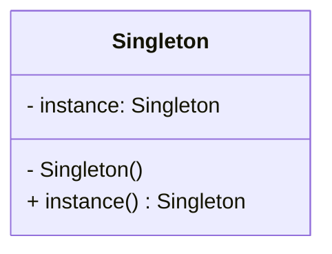

# 单例设计模式
在本章中，将会涉及以下主题：
- 理解单例设计模式；
- 单例模式实例；
- 单例设计模式的Python实现；
- Monostate(Borg)模式。

## 2.1 理解单例设计模式

1. 单例模式提供的机制是**确保雷有且只有一个特定类型的对向，并提供全局访问点**。
2. 简言之，单例设计模式的意图如下所示。
  - 确保类有且只有一个对象被创建。
  - 为对象提供一个访问点，以便程序可以全局访问该对象。
  - 控制共享资源的并行访问。


*markdow画uml图[链接](https://blog.csdn.net/ifadai/article/details/136046263)*

实现单例模式的简单方法是，使构造函数私有化，并创建一个静态方法来完成对象的初始化。

### 利用python实现经典的单例模式

```python
class Singleton(object):
    def __new__(cls, *args, **kwargs):
        if not hasattr(cls, 'instance'):
            cls.instance = super(Singleton, cls).__new__(cls)
        return cls.instance
```
```python
s = Singleton()
print("Object crearted", s)

s1 = Singleton()
print("Object crearted", s1)
```
通过覆盖__new__方法来控制对象的创建。对象s就是有__new__方法创建的，但在创建之前，该方法会检查对象是否已存在。

## 2.2 单例模式中的懒汉式实例化

懒汉式实例化能够确保在实际需要时才创建对象。所以，懒汉式实例化是一种节约资源并仅在需要时才创建它们的方式。
```python
class Singleton:
    __instance = None
    def __init__(self):
        if not Singleton.__instance:
            print("__init__ method called..")
        else:
            print("Instance already created:", self.getInstance())
    @classmethod
    def getInstance(cls):
        if not cls.__instance:
            cls.__instance = Singleton()
        return cls.__instance
```

```python
s = Singleton()  ## class initialized, but object not created
print("Object created", Singleton.getInstance())  ## Object gets created here
s1 = Singleton()  ## instance already created
```

## 2.3 模块级别的单例模式

默认情况下，所有的模块都是单例的，这是由Python的导入行为所决定的。
python通过下列方式来工作。
1. 检查一下python模块是否已经导入。
2. 如果已导入，则返回该模块的对象。如果还没导入，则导入该模块，并实例化。
3. 单例模式只能有一个对象，当一个模块再次导入时，它不会再次初始化。

## 2.4 Monostate单例模式

Monostate（单态）模式可以通过Python轻松实现。
```python
class Borg:
    __shared_state = {"1": "2"}
    def __init__(self):
        self.x = 1
        self.__dict__ = self.__shared_state
        pass
```
```python
b = Borg()
b1 = Borg()
b.x = 4

print("Borg Object 'b': ", b)  ## b and b1 are distance objects
print("Borg Object 'b1': ", b1)
print("Borg State 'b': ", b.__dict__)  ## b and b1 are share same state
print("Borg State 'b1': ", b1.__dict__)
```
此外，还可以通过__new__方法本身来实现Borg模式。
```python
class Borg(object):
    __shared_state = {}
    def __new__(cls, *args, **kwargs):
        obj = super(Borg, cls).__new__(cls, *args, **kwargs)
        obj.__dict__ = cls.__shared_state
        return obj
```

## 单例和元类
1. 在Python中，一切皆为对象。例如 a = 5, 则 type(a) 返回的是 <type 'int'>，这意味着a是int类型。但type(int)返回的是<type 'type'>，表明存在一个元类，因为int是type类型的类。
2. 类的定义是由它的元类决定。Python通过A=type(name, bases, dict)创建它。
 - name：这是类的名字
 - base：这是基类
 - dict：这是属性变量
```python
class MyInt(type):
    def __call__(cls, *args, **kwargs):
        print("**** Here's My int ****", args)
        print("Now do whatever you with these objects...")
        return type.__call__(cls, *args, **kwargs)
```
```python
class int(metaclass=MyInt):
    def __init__(self, x, y):
        self.x = x
        self.y = y
```
```python
i = int(4, 5)
```
元类控制着对象的实例化，这思路同样适用于单例设计模式。
```python
class MetaSingleton(type):
    _instance = {}
    def __call__(self, *args, **kwargs):
        if cls is not in cls._instance:
            cls._instance[cls] = super(MetaSingleton, cls).__call__(*args, **kwargs)
        return cls._instance[cls]

class Logger(metaclass=MetaSingleton):
    pass
```
```python
logger1 = Logger()
logger2 = Logger()
print(logger1, logger2)
```
