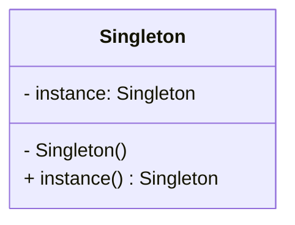

# 单例设计模式
在本章中，将会涉及以下主题：
- 理解单例设计模式；
- 单例模式实例；
- 单例设计模式的Pthon实现；
- Monostate(Borg)模式。

## 2.1 理解单例设计模式

1. 单例模式提供的机制是**确保雷有且只有一个特定类型的对向，并提供全局访问点**。
2. 简言之，单例设计模式的意图如下所示。
  - 确保类有且只有一个对象被创建。
  - 为对象提供一个访问点，以便程序可以全局访问该对象。
  - 控制共享资源的并行访问。


*markdow画uml图[链接](https://blog.csdn.net/ifadai/article/details/136046263)*

实现单例模式的简单方法是，使构造函数私有化，并创建一个静态方法来完成对象的初始化。

### 利用python实现经典的单例模式

```python
class Singleton(object):
    def __new__(cls, *args, **kwargs):
        if not hasattr(cls, 'instance'):
            cls.instance = super(Singleton, cls).__new__(cls)
        return cls.instance
```
```python
s = Singleton()
print("Object crearted", s)

s1 = Singleton()
print("Object crearted", s1)
```
通过覆盖__new__方法来控制对象的创建。对象s就是有__new__方法创建的，但在创建之前，该方法会检查对象是否已存在。

## 2.2 单例模式中的懒汉式实例化


## 2.3 模块级别的单例模式


## 2.4 Monostate单例模式