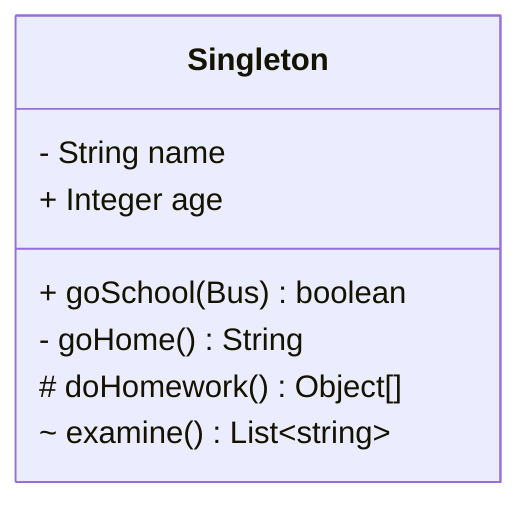

# 单例设计模式
在本章中，将会涉及以下主题：
- 理解单例设计模式；
- 单例模式实例；
- 单例设计模式的Pthon实现；
- Monostate(Borg)模式。

## 2.1 理解单例设计模式

markdow画uml图[链接](https://blog.csdn.net/ifadai/article/details/136046263)

## 2.2 单例模式中的懒汉式实例化

## 2.3 模块级别的单例模式

## 2.4 Monostate单例模式