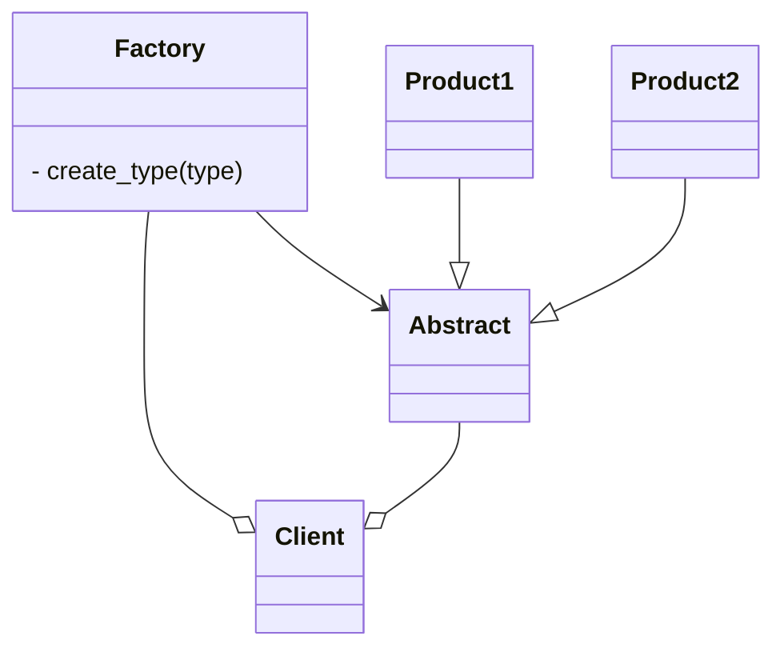
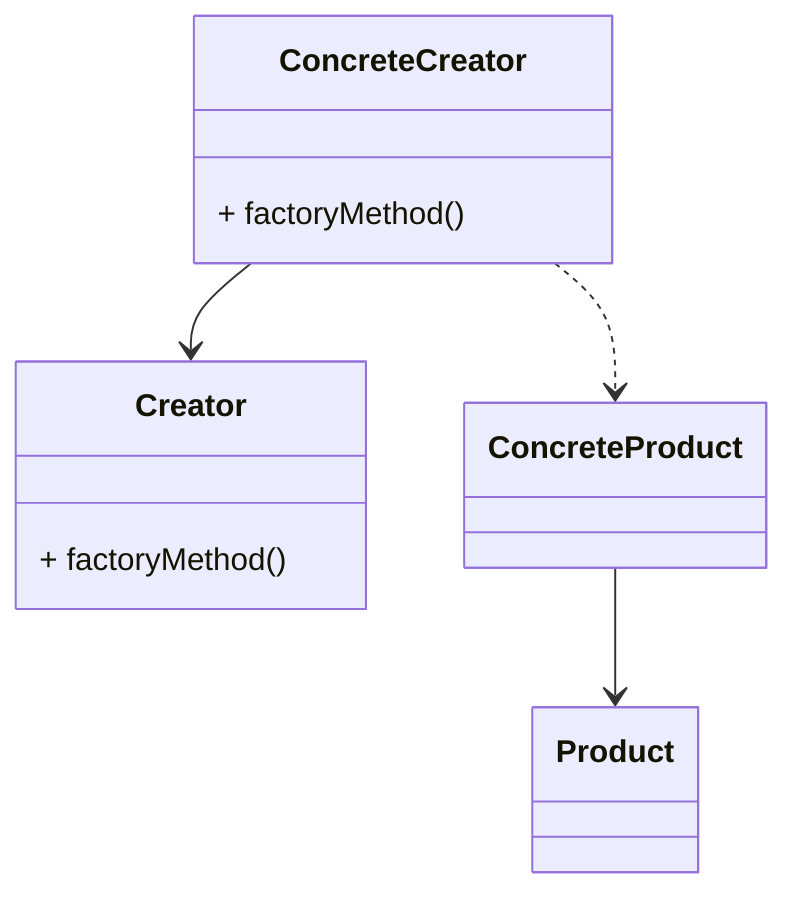

# 工厂模式
工厂模式可以说是最常用的设计模式。在本章中，将会涉及以下主题：
- 了解简单的工厂设计模式；
- 讨论工厂方法和抽象工厂方法以及差异；
- 利用Python代码实现真实场景；
- 讨论模式的优缺点并进行相应的比较。

## 了解工厂模式

1. 在面向面对象编程中，术语”工厂“表示一个负责创建其它类型对象的类。通常情况下，作为一个工厂的类有一个对象以及与它关联的多个方法。
2. 工厂具有下列有点：
   - 松耦合，即对象的创建可以独立于类的实现。
   - 客户端无需了解创建对象的类，只需要知道需要传递的借口，方法和参数，就能够创建所需类型的对象了。
   - 可以轻松在工厂中添加其它类来创建其它类型的对象。无需更改客户端代码。
   - 工厂还可以重用现有对象。
3. Factory模式有3种变体：
   - **简单工厂模式**：允许接口创建对象，但不会暴露对象的创建逻辑。
   - **工厂方法模式**：允许接口创建对象，但使用哪个类来创建对象由子类决定。
   - **抽象工厂模式**：能够创建一系列相关对象而无需指定/公开其具体类的接口，能够提供其他工厂的对象，在其内部创建其他对象。

## 简单工厂模式



*markdow画uml图[链接](https://blog.csdn.net/qq_41084756/article/details/129066162)*

实现单例模式的简单方法是，使构造函数私有化，并创建一个静态方法来完成对象的初始化。

```python
from abc import ABCMeta, abstractmethod


class Animal(metaclass=ABCMeta):
    @abstractmethod
    def do_say(self):
        pass
   
   
class Dog(Animal):
    def do_say(self):
        print("Bhow Bhow!")
       
       
class Cat(Animal):
    def do_say(self):
        print("Meow Meow!")


## forest factory defined
class ForestFactory(object):
    def make_sound(self, object_type):
        return eval(object_type().do_say)
```
```python
## client code
if __name__ == "__main__":
    forest = ForestFactory()
    animal = input("Which animal do you want to create?")
    forest.make_sound(animal)
```
利用Animal接口创建了两种产品（Dog和Cat），并使用do_say()方法来提供这些动物的相应叫声。ForestFactory是一个带有make_sound方法的工厂。

## 工厂方法模式
1. 定义接口创建对象，但工厂本身并不负责创建对象，由子类完成。
2. Factory方法通过继承来创建对象。
3. 工厂方法使设计具有可定制性。

上图UML中，Creator接口的factoryMethod()方法和ConcreteCreator()类共同决定了要创建Product的哪个子类。因此，工厂方法模式定义了一个接口来创建对象，但具体
实例化哪个类则是由他的子类来决定。

### 实现工厂方法
```python
from abc import ABCMeta, abstractmethod


class Section(metaclass=ABCMeta):
    @abstractmethod
    def describe(self):
        pass
   
   
class PersonalSection(Section):
    def describe(self):
        print("Personal Section")
      
      
class AlbumSection(Section):
    def describe(self):
        print("Album Section")
      

class PatentSection(Section):
    def describe(self):
        print("Patent Section")
      
      
class PublicationSection(Section):
    def describe(self):
        print("Publication Section")


class Profile(metaclass=ABCMeta):
    def __init__(self):
        self.sections = []
        self.create_profile()
      
    @abstractmethod
    def create_profile(self): 
        pass
    
    def get_section(self):
         return self.sections
    
    def add_section(self, section):
        self.sections.append(section)
      
        
class linkedin(Profile):
    def create_profile(self):
        self.add_section(PersonalSection())
        self.add_section(PatentSection())
        self.add_section(PublicationSection())
        
        
class facebook(Profile):
    def create_profile(self):
        self.add_section(PersonalSection())
        self.add_section(AlbumSection())
```
```python
if __name__ == "__main__":
    profile_type = input("Which profile you'd like to create? [LinkedIn or Facebook]")
    profile = eval(profile_type.lower())()
    print("Creating Profile ..", type(profile).__name__)
    print("Profile has sections --", profile.get_section)
```
以Facebook为例，它实例化facebook [ConcreteCreator]类。它会在内部创建ConcreteProduct，将实例化PersonalSection和AlbumSection。
如果选择LinkedIn，则实例化linkedin [ConcreteCreator]类。它会在内部创建ConcreteProduct，将实例化PersonalSection、PatentSection和PublicationSection。

### 工厂方法模式的优点
1. 更大的灵活性，使得代码更加通用。
2. 松耦合。创建对象的代码与使用的代码分开。添加新类更加容易，降低维护成本。

## 抽象工厂模式


