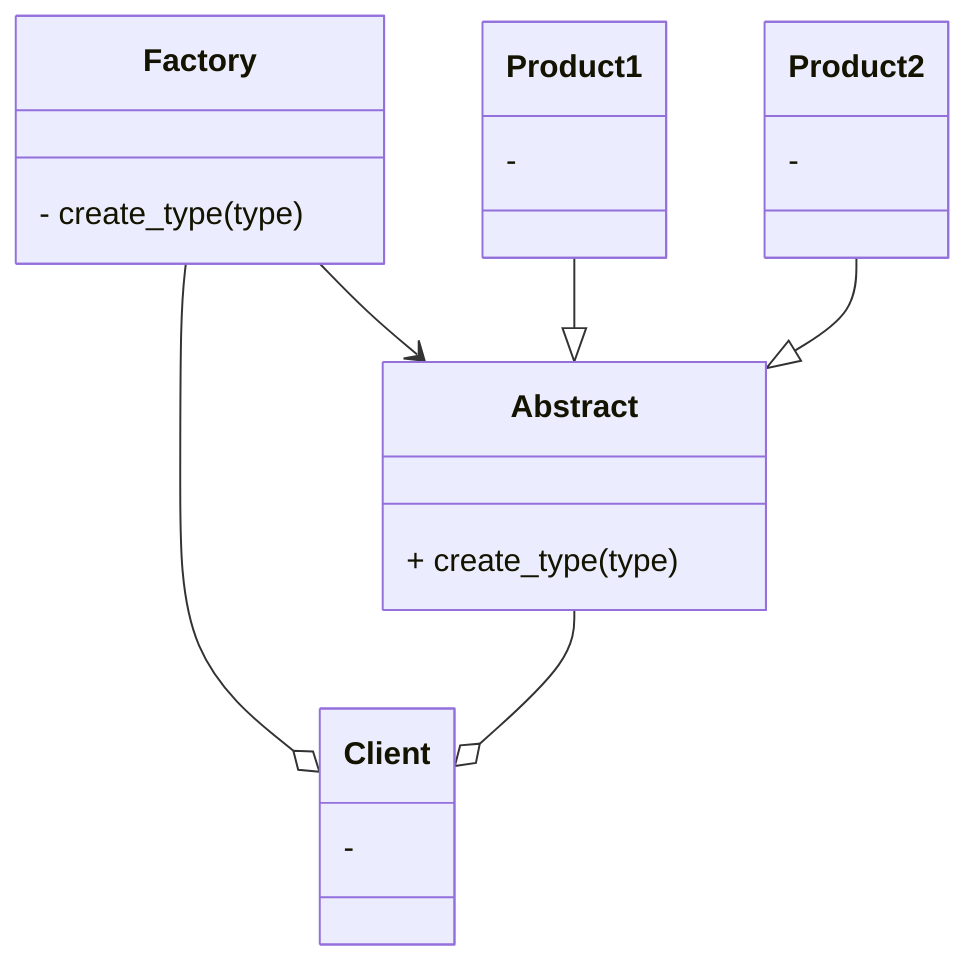

# 工厂模式
工厂模式可以说是最常用的设计模式。在本章中，将会涉及以下主题：
- 了解简单的工厂设计模式；
- 讨论工厂方法和抽象工厂方法以及差异；
- 利用Python代码实现真实场景；
- 讨论模式的优缺点并进行相应的比较。

## 了解工厂模式

1. 在面向面对象编程中，术语”工厂“表示一个负责创建其它类型对象的类。通常情况下，作为一个工厂的类有一个对象以及与它关联的多个方法。
2. 工厂具有下列有点：
   - 松耦合，即对象的创建可以独立于类的实现。
   - 客户端无需了解创建对象的类，只需要知道需要传递的借口，方法和参数，就能够创建所需类型的对象了。
   - 可以轻松在工厂中添加其它类来创建其它类型的对象。无需更改客户端代码。
   - 工厂还可以重用现有对象。
3. Factory模式有3种变体：
   - **简单工厂模式**：允许接口创建对象，但不会暴露对象的创建逻辑。
   - **工厂方法模式**：允许接口创建对象，但使用哪个类来创建对象由子类决定。
   - **抽象工厂模式**：能够创建一系列相关对象而无需指定/公开其具体类的接口，能够提供其他工厂的对象，在其内部创建其他对象。

## 简单工厂模式



*markdow画uml图[链接](https://blog.csdn.net/qq_41084756/article/details/129066162)*

实现单例模式的简单方法是，使构造函数私有化，并创建一个静态方法来完成对象的初始化。

```python
from abc import ABCMeta, abstractmethod


class Animal(metaclass=ABCMeta):
   @abstractmethod
   def do_say(self):
      pass
   
   
class Dog(Animal):
   def do_say(self):
      print("Bhow Bhow!")
       
       
class Cat(Animal):
   def do_say(self):
      print("Meow Meow!")


## forest factory defined
class ForestFactory(object):
  def make_sound(self, object_type):
        return eval(object_type().do_say)
```
```python
## client code
if __name__ == "__main__":
    forest = ForestFactory()
    animal = input("Which animal do you want to create?")
    forest.make_sound(animal)
```

