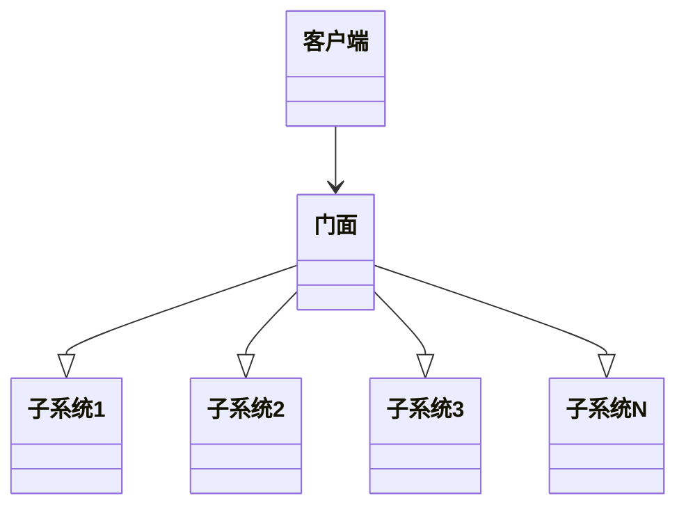

# 门面模式——与门面相适应
无论是工厂设计模式还是单例设计模式，都属于创建型设计模式。而门面设计模式，属于结构型设计模式。在本章中，将会涉及以下主题：
- 结构型设计模式概要；
- 利用UML图理解门面设计模式；
- 提供Python代码实现真实用例；
- 门面模式与最少知识原则。

## 理解结构型设计模式

1. 结构型模式描述如何将对象和类组合成更大的结构。
2. 结构型模式是一种能够简化设计工作的模式，它能够找出更简单的方法来认识或表示实体之间的关系。在面向对象世界中，实体指的是对象或类。
3. 类模式可以通过继承来描述抽象，从而提供更有用的程序接口，而对象模式则描述了如何将对象那个联系起来从而组合更大的对象。结构型模式是类和对象模式的综合体。
4. 下面是一些结构型设计模式的例子：
   - 适配器模式：将一个接口转换成客户希望的另一个接口。根据需求来适配不同类型的接口；
   - 桥接模式：该模式将对象的接口与其实现进行解耦，使得两者可以独立工作；
   - 装饰器模式：该模式允许在运行时以动态方式为对象添加职责，通过接口给对象添加某些属性。

## 理解门面设计模式
1. 门面（facade）通常是指建筑的表面。尤其是最有吸引力的那一面。它可以表示一种容易让人误解某人的真实感受或情况的行为或面貌。当
人们从建筑物从外面经过时，可以欣赏其外部面貌，却不了解建筑物结构的复杂性。这就是门面方式的使用方式。
2. 以店主为例介绍。假设你要到某个桑点买东西，但是你对这个商店的布局并不清楚。通常情况下，你会去找店主，因为店主对整个商店都很清楚。
这里的接口就是店主。
3. 门面设计模式实际上完成了下列事项：
   - 它为子系统中的一组接口提供了统一的接口，并定义了一个高级的接口来帮助客户端通过更加简单的方式使用子系统。
   - 门面所解决的问题是，如何用单个接口对象来表示复杂的子系统。实际上，他并不是封装子系统，而是对底层子系统进行组合。
   - 他促进了实现与多个客户端的解耦。

## UML图

这个模式有3个主要主要的参与者：
- 门面：将一组复杂系统封装起来，从而为外部世界提供一个舒适的外观；
- 系统：表示一组不同的子系统，使整个系统混杂在一起，难以观察或使用；
- 客户端：客户端与门面进行交互，并使用门面来调用子系统的方法。

### 门面

- 它是一个接口，它知道某个请求可以交由哪个子系统进行处理。
- 它使用组合将客户端的请求委派给相应的子系统对象。

### 系统
在门面系统里，系统就是执行以下操作的实体。
  - 它实现子系统的功能。同时，系统由一个类表示；
  - 它处理门面对象分配的工作，但并不知道门面，而且不引用它。

### 客户端
- 客户端是实例化门面的类。
- 为了让子系统完成相应的工作，客户端需要向门面提出请求。

## 在现实世界中实现门面设计模式

