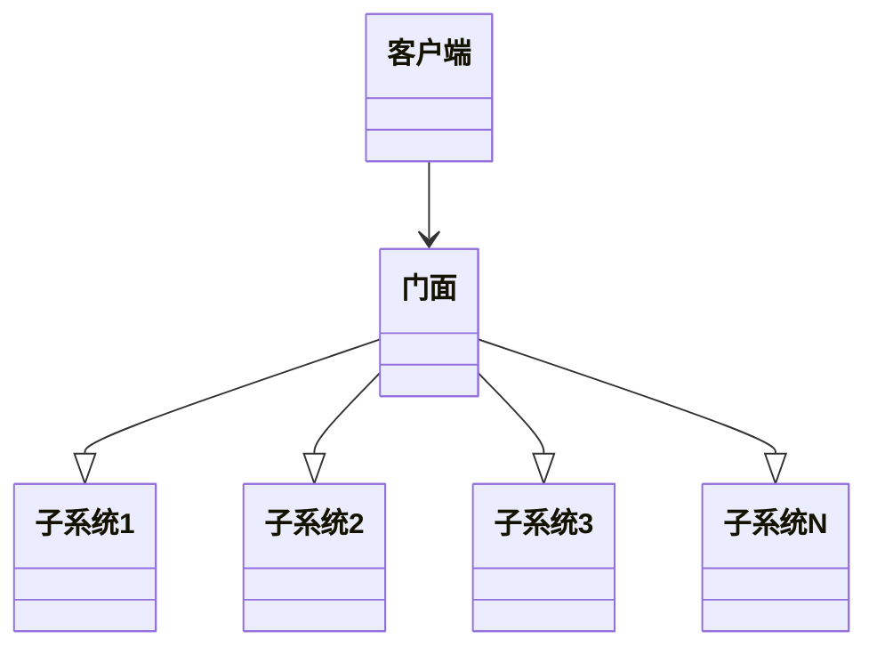
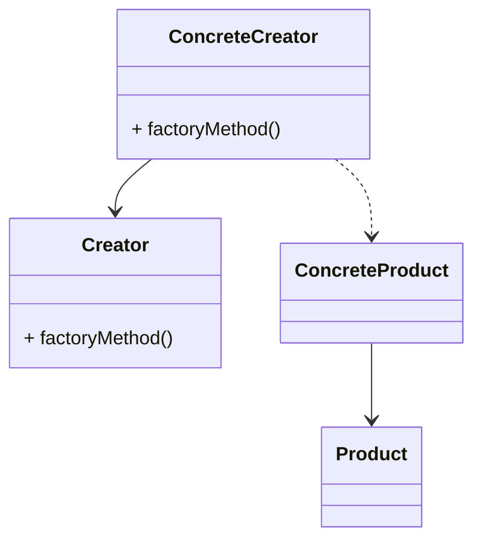
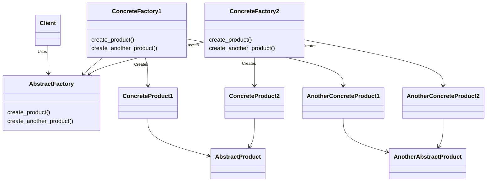

# 门面模式——与门面相适应
无论是工厂设计模式还是单例设计模式，都属于创建型设计模式。而门面设计模式，属于结构型设计模式。在本章中，将会涉及以下主题：
- 结构型设计模式概要；
- 利用UML图理解门面设计模式；
- 提供Python代码实现真实用例；
- 门面模式与最少知识原则。

## 理解结构型设计模式

1. 结构型模式描述如何将对象和类组合成更大的结构。
2. 结构型模式是一种能够简化设计工作的模式，它能够找出更简单的方法来认识或表示实体之间的关系。在面向对象世界中，实体指的是对象或类。
3. 类模式可以通过继承来描述抽象，从而提供更有用的程序接口，而对象模式则描述了如何将对象那个联系起来从而组合更大的对象。结构型模式是类和对象模式的综合体。
4. 下面是一些结构型设计模式的例子：
   - 适配器模式：将一个接口转换成客户希望的另一个接口。根据需求来适配不同类型的接口；
   - 桥接模式：该模式将对象的接口与其实现进行解耦，使得两者可以独立工作；
   - 装饰器模式：该模式允许在运行时以动态方式为对象添加职责，通过接口给对象添加某些属性。

## 理解门面设计模式




*markdow画uml图[链接](https://blog.csdn.net/qq_41084756/article/details/129066162)*

实现单例模式的简单方法是，使构造函数私有化，并创建一个静态方法来完成对象的初始化。

```python
from abc import ABCMeta, abstractmethod


class Animal(metaclass=ABCMeta):
    @abstractmethod
    def do_say(self):
        pass
   
   
class Dog(Animal):
    def do_say(self):
        print("Bhow Bhow!")
       
       
class Cat(Animal):
    def do_say(self):
        print("Meow Meow!")


## forest factory defined
class ForestFactory(object):
    def make_sound(self, object_type):
        return eval(object_type().do_say)
```
```python
## client code
if __name__ == "__main__":
    forest = ForestFactory()
    animal = input("Which animal do you want to create?")
    forest.make_sound(animal)
```
利用Animal接口创建了两种产品（Dog和Cat），并使用do_say()方法来提供这些动物的相应叫声。ForestFactory是一个带有make_sound方法的工厂。

## 工厂方法模式
1. 定义接口创建对象，但工厂本身并不负责创建对象，由子类完成。
2. Factory方法通过继承来创建对象。
3. 工厂方法使设计具有可定制性。

上图UML中，Creator接口的factoryMethod()方法和ConcreteCreator()类共同决定了要创建Product的哪个子类。因此，工厂方法模式定义了一个接口来创建对象，但具体
实例化哪个类则是由他的子类来决定。

### 实现工厂方法
```python
from abc import ABCMeta, abstractmethod


class Section(metaclass=ABCMeta):
    @abstractmethod
    def describe(self):
        pass
   
   
class PersonalSection(Section):
    def describe(self):
        print("Personal Section")
      
      
class AlbumSection(Section):
    def describe(self):
        print("Album Section")
      

class PatentSection(Section):
    def describe(self):
        print("Patent Section")
      
      
class PublicationSection(Section):
    def describe(self):
        print("Publication Section")


class Profile(metaclass=ABCMeta):
    def __init__(self):
        self.sections = []
        self.create_profile()
      
    @abstractmethod
    def create_profile(self): 
        pass
    
    def get_section(self):
         return self.sections
    
    def add_section(self, section):
        self.sections.append(section)
      
        
class linkedin(Profile):
    def create_profile(self):
        self.add_section(PersonalSection())
        self.add_section(PatentSection())
        self.add_section(PublicationSection())
        
        
class facebook(Profile):
    def create_profile(self):
        self.add_section(PersonalSection())
        self.add_section(AlbumSection())
```
```python
if __name__ == "__main__":
    profile_type = input("Which profile you'd like to create? [LinkedIn or Facebook]")
    profile = eval(profile_type.lower())()
    print("Creating Profile ..", type(profile).__name__)
    print("Profile has sections --", profile.get_section)
```
以Facebook为例，它实例化facebook [ConcreteCreator]类。它会在内部创建ConcreteProduct，将实例化PersonalSection和AlbumSection。
如果选择LinkedIn，则实例化linkedin [ConcreteCreator]类。它会在内部创建ConcreteProduct，将实例化PersonalSection、PatentSection和PublicationSection。

### 工厂方法模式的优点
1. 更大的灵活性，使得代码更加通用。
2. 松耦合。创建对象的代码与使用的代码分开。添加新类更加容易，降低维护成本。

## 抽象工厂模式
抽象工厂模式的主要目的是创建一系列相关的对象，而不需要指定其具体类。工厂方法将创建实例的任务委托给子类，而抽象工厂方法的目的是创建一系列相关对象。

ConcreteFactory1和ConcreteFactory2实现了AbstractFactory，并创建ConcreteProduct1、ConcreteProduct2、AhotherConcreteProduct1、AhotherConcreteProduct2。

### 实现抽象工厂模式
详情见 pizza_factory.py

## 工厂方法与抽象工厂方法

| 工厂方法               | 抽象工厂方法                 |
|--------------------|------------------------|
| 它向客户开放了一个创建对象的方法   | 包含一个或多个工厂方法来创建一系列的相关对象 |
| 它使用继承和子类来决定要创建哪些对象 | 它使用组合将创建对象的任务委托给其他类    |
| 工厂方法用于创建一个产品       | 用于创建相关产品系列             |


